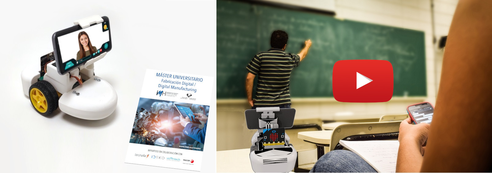

# Robot de Telepresencia

Este proyecto desarrolla el proceso de desarrollo y fabricación industrial de un robot de telepresencia para las personas mayores y estudiantes enfermos que no pueden interactuar con sus amigos. Consiste en que el robot se coloca sobre una mesa y el usuario puede utilizar el robot por control remoto desde su casa/residencia/hospital. Permite ver y hablar, levantar la mano y mover el robot. Además, este robot de telepresencia incluye un sensor de CO2, temperatura y humedad que permite evaluar la necesidad de ventilar.  

# Proceso de fabricación
El proceso de fabricación se simula utilizando un PLC S7-1200 de SIEMENS y el software Factory.io

##Proceso separación del empaquetado para su envío.
##Proceso de clasificación de piezas.

# Firmware del robot para Microbit

El firmware del robot para la tarjeta Microbit se ha desarrollado en lenguaje MicroPyhon. A continuación se describen algunos puntos clave del código. 

# App
## Cómo inicializar
Run `npm install`

Para ejecutarlo en tu móvil (conectador por USB), ejecutar:
Run `ionic cordova run android`

Para ver si él móvil está conectado, ejecutar
Run `adb devices`

## Archivos requeridos

Se requieren las siguientes líneas en el directorio raíz del proyecto, pero no se incluyen en el repositorio. En cambio, hay archivos .example que muestran como se deben de estructurar.

* .env.prod
* .env.dev

# Backend

## Cómo inicializar
Hacer una copia de backend/docker/.env.example y renombrarlo a .env y asignar los valores adecuados Estos deben corresponderse con los archivos .env de la App. 

# Diseño mecánico del robot para impresión 3D y Realidad Aumentada

Se puede visualizar el robot en Realidad Aumentada, escaneando el siguiénte código QR. 

# Medición de CO2 en el aula y visualización con Node-Red

Se ha desarrollado un firmware para un microcontrolador Particle.io que lee de un sensor DHT11 de temperatura y humedad y un sensor CCS811 de eCO2 y VOC. Los datos recogidos se pueden visualizar en el siguiente enlace. 

# Ver también

# Créditos

La información sobre Robbit se encuentra disponible en  https://www.robbit.se creado por el instituto sueco RISE. 

Modelos 3D del proyecto https://www.thingiverse.com/thing:3360113

Using the sound Open Button 2 by Kickhat with creative commons 0 license.
https://freesound.org/people/kickhat/sounds/264447/

Using the sound Correct by Ertfelda with creative commons 0 license.
https://freesound.org/people/ertfelda/sounds/243701/

